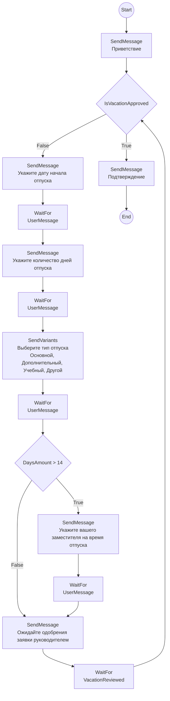

# DotNext 2023. Workflow Architecture

### Воркфлоу заявки на отпуск сотрудника

```mermaid
flowchart TB
startNode((Start))
0[SendMessage\nПриветствие]
1{IsVacationApproved}
2[SendMessage\nУкажите дату начала отпуска]
3["WaitFor\nUserMessage"]
4[SendMessage\nУкажите количество дней отпуска]
5["WaitFor\nUserMessage"]
6[SendVariants\nВыберите тип отпуска\nОсновной, Дополнительный, Учебный, Другой]
7["WaitFor\nUserMessage"]
8{DaysAmount > 14}
9[SendMessage\nУкажите вашего заместителя на время отпуска]
10["WaitFor\nUserMessage"]
11[SendMessage\nОжидайте одобрения заявки руководителем]
12["WaitFor\nVacationReviewed"]
13[SendMessage\nПодтверждение]
14((End))

startNode --> 0
0 --> 1
1 -->|True| 13
1 -->|False| 2
2 --> 3
3 --> 4
4 --> 5
5 --> 6
6 --> 7
7 --> 8
8 -->|True| 9
8 -->|False| 11
9 --> 10
10 --> 11
11 --> 12
12 --> 1
13 --> 14
```